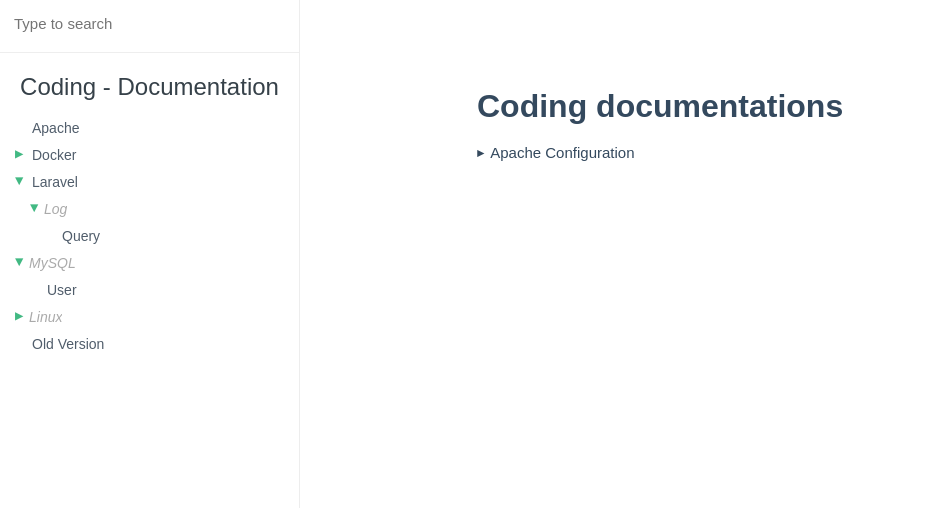

# Docsify plugin treemenu

display tree menu on the sidebar

---

`menu.json`

```json
[
    ["Apache", "apache/make-site", []],
    ["Docker", "docker/index", [
        ["PHP", "docker/php", []],
    ]],
    ["Laravel", "laravel/index", [
        ["Log", "", [
            ["Query", "laravel/log/query", []]
        ]]
    ]],
    ["MySQL", "", [
        ["User", "mysql/user", []]
    ]],
    ["Linux", "", [
        ["mx21", "", [
            ["Install", "linux/mx21/install/index", [
                ["From Package Manager", "linux/mx21/install/index?id=from-package-manager", []],
                ["Docker", "linux/mx21/install/docker", []],
                ["LAMP", "linux/mx21/install/lamp", []]
            ]]
        ]]
    ]],
    ["Old Version", "http://test.old", []]
]
```

